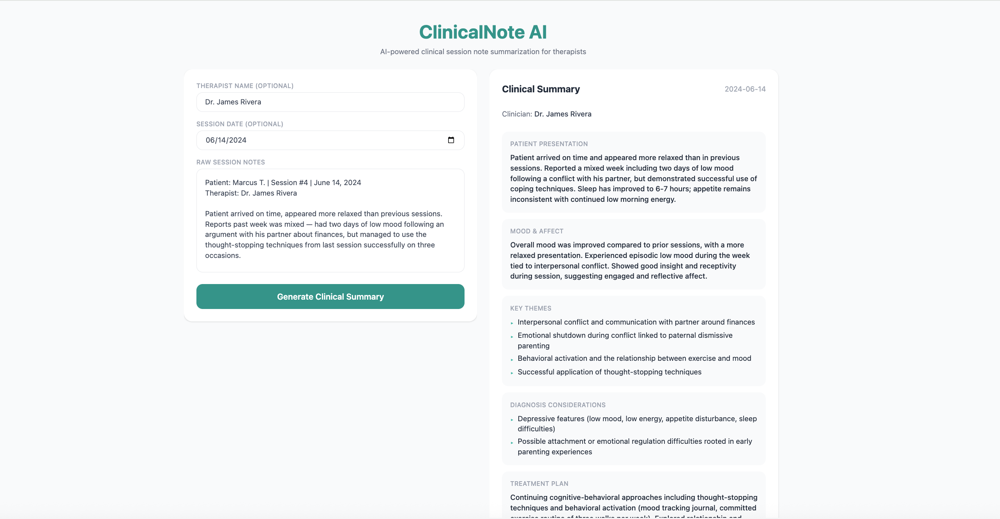

# ClinicalNote AI

An AI-powered clinical session note summarization tool that helps therapists convert raw session notes into structured clinical summaries using the Anthropic Claude API.

## What it does

ClinicalNote AI accepts raw therapist session notes and generates a structured clinical summary including:

- **Patient Presentation** — how the patient presented during the session
- **Mood & Affect** — emotional state and changes throughout the session
- **Key Themes** — main topics and issues discussed
- **Diagnosis Considerations** — relevant diagnostic considerations noted
- **Treatment Plan** — current interventions and therapeutic approach
- **Follow-up Items** — action items and topics for the next session
- **Risk Assessment** — safety considerations and risk factors

## Tech Stack

**Backend**
- FastAPI
- Anthropic Claude API (generative AI summarization + prompt engineering)
- Pydantic (data validation and response modeling)
- Python-dotenv

**Frontend**
- React with TypeScript
- Vite
- Tailwind CSS

## Project Structure
## Project Structure

clinicalnote-ai/
├── backend/
│   ├── main.py          # FastAPI app and routes
│   ├── extractor.py     # Claude API integration and clinical summary generation
│   ├── models.py        # Pydantic data models
│   └── requirements.txt
└── frontend/
    └── src/
        ├── App.tsx
        ├── api.ts
        └── components/
            ├── NoteForm.tsx
            ├── SummaryPanel.tsx
            └── SummaryCard.tsx

## Running Locally

**Backend**
```bash
cd backend
python3 -m venv venv
source venv/bin/activate
pip install -r requirements.txt
# Add your Anthropic API key to a .env file: ANTHROPIC_API_KEY=your_key_here
uvicorn main:app --reload
```

**Frontend**
```bash
cd frontend
npm install
npm run dev
```

## Example Input
Patient arrived on time, appeared distressed. Reports increased anxiety

this week related to work stress. Discussed CBT techniques for managing

anxiety. Patient expressed difficulty sleeping. No safety concerns.

Plan to continue CBT next session.

## Example Output

- **Patient Presentation:** Patient arrived on time and reported feeling anxious due to work stress.
- **Mood & Affect:** Anxious; elevated stress related to work demands and difficulty sleeping.
- **Key Themes:** Work-related stress, sleep difficulties, coping skills development
- **Risk Assessment:** No acute risk factors identified
## Screenshot
